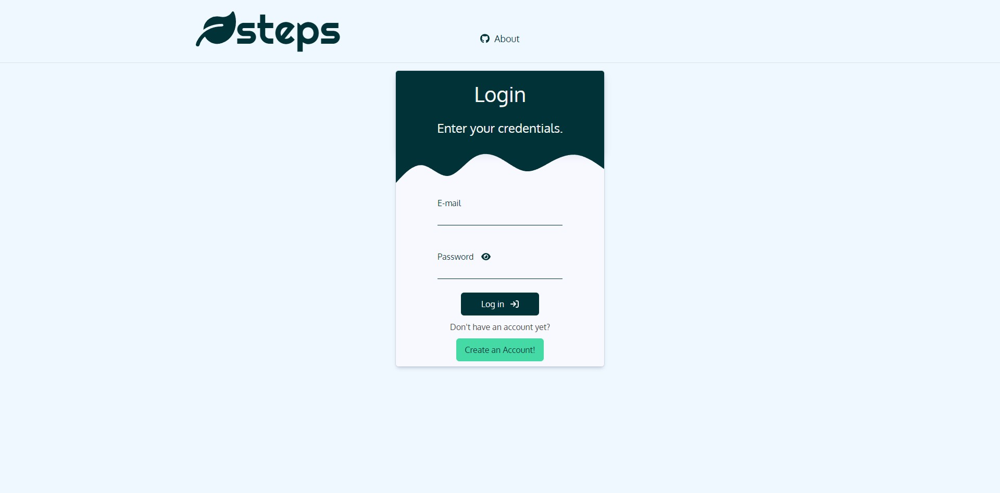
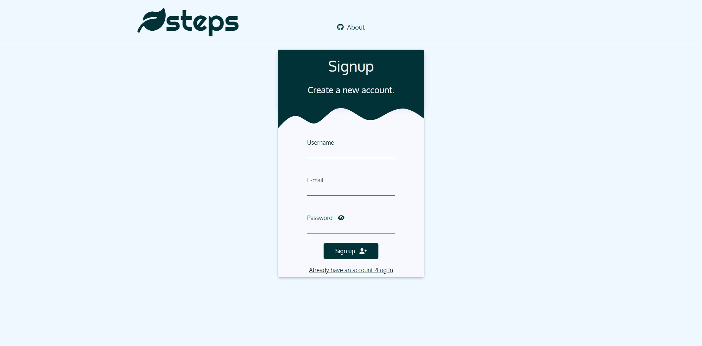
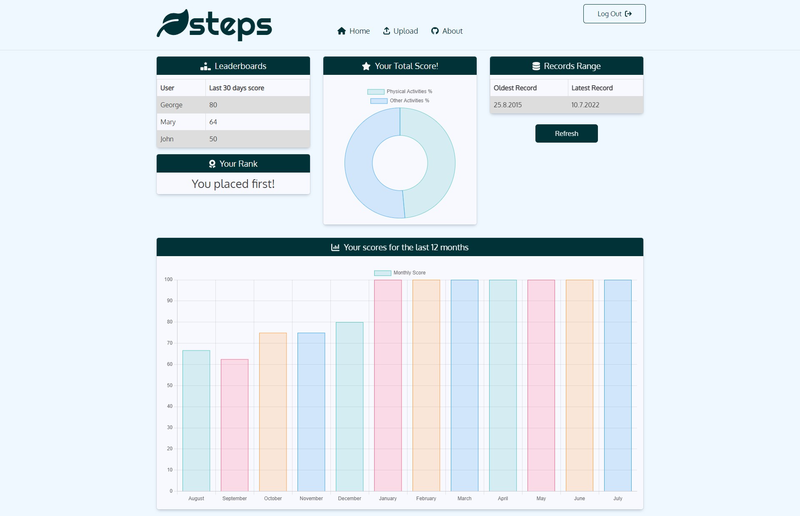
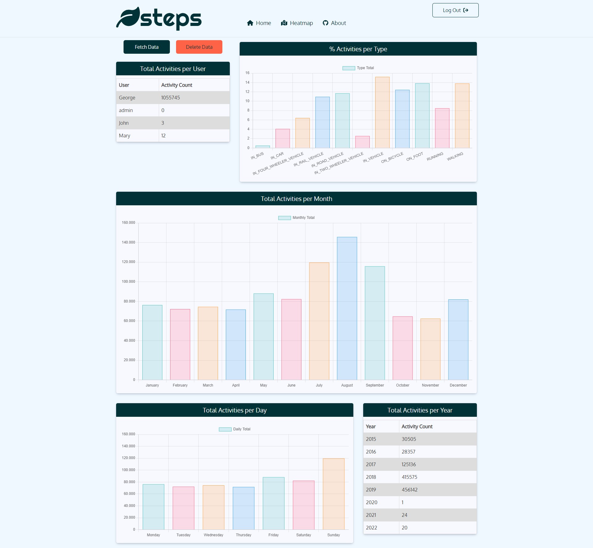
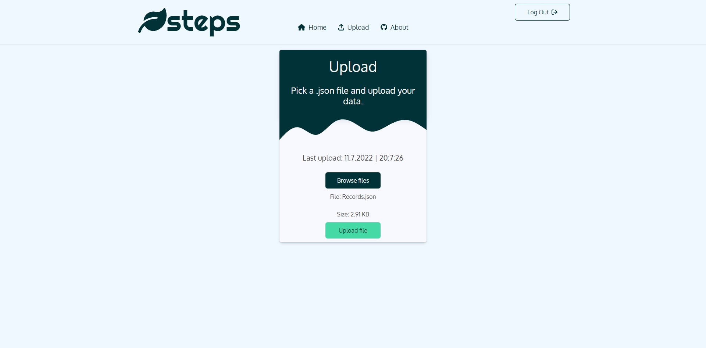
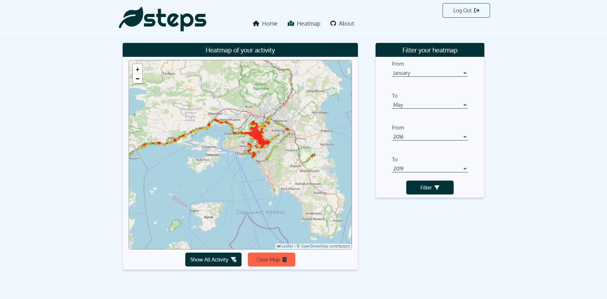
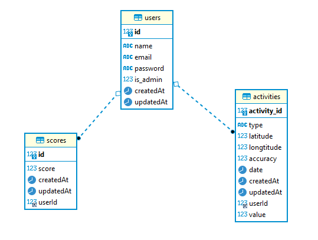

# WELCOME TO THE STEPS PROJECT

## ABOUT
**STEPS:	uSer acTivity ExPloitation System**

The aim of this project is the development of a complete, full-stack SPA web application for collection, management and
analysis of crowdsourced information, concerning spatiotemporal human activity data. Such data is provided by google via the location history JSON file. Users can download their location data from google in the following url: https://takeout.google.com . 

The goal was successfully implemented, nevertheless the application is still expandable with new features.

## SUPPORTED FEATURES
  The system supports the creation of both simple users and administrators. 

  **Administrator**
  - Has access to an admin dashboard populated with useful information about the users' activity, shown through charts and tables.
  - Has access to a map with a configurable heatmap layer showing user activity.

  
  **Users**
  - Are able to create an account for the application and sign in with their credentials securely.
  - Are able to upload a Location History JSON file of their activity. The app is tested even for 3 million insertions.
  - Have access to a user dashboard where useful information about their activity is shown through charts and tables.
  - Have personal eco scores (physical activities / total activities). 
  - Have access to a leaderboard depending on their eco score. Their rank is displayed as well as the users with the top 3 highest scores.
 
## PROJECT PREVIEW

|Log In            |                 Sign Up                  |
| :--------------------------: | :--------------------------------------: |
|  |  |

  |     User DashBoard     |  Administrator DashBoard   |
  | :--------------------: | :------------------------: |
  |  |  |

|       User Upload Form       |      Administrator Heatmap Feature       |
| :--------------------------: | :--------------------------------------: |
|  |  |

## TOOLS
Full Dev Stack: 
- MySQL 
- Express 
- NodeJS 
- ReactJS
### Front End
For the Front End I used ReactJS. 

For the dashboad layout I used some react-bootstrap.

For the forms I used formik in some cases.

For the charts I used react-chartjs-2.

For the maps I used leaflet and leaflet heatmap.js plugin.

For the icons I used font-awesome icons.

The application is also fully responsive for all devices.
### Back End
For the Back Eend I developed a REST API to handle my requests to the server using mainly NodeJS and Express. 

Users are secured via JWT Token authentication.

Take a look at the API implementation in this repo: https://github.com/ggrkp/api-project

### Database
For the Database I used MySQL and sequelize. Also for my convenience in handling the db I used DBeaver. 

|ER Diagram          
| :--------------------------
|  

